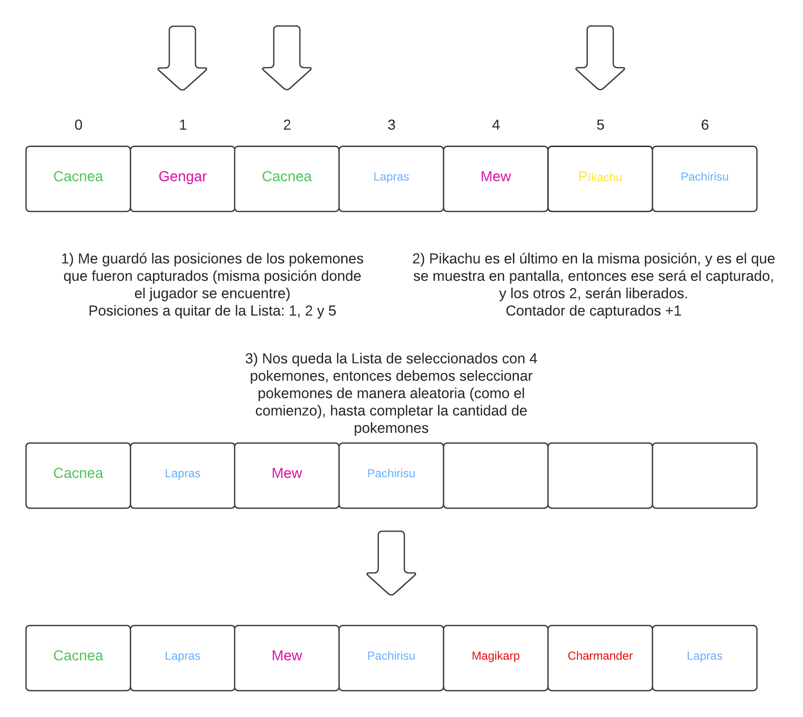

<div align="right">

</div>

# TP 2

## Repositorio de (Juan Ernesto Juarez Lezama) - (110418) - (jjuarez@fi.uba.ar)

- Para ejecutar:

```bash
make
```
Se ejecutará tanto las pruebas como el tp2.c con valgrind.

---

## Para este TP implementé 4 TDA:

### TDA Pokedex
El TDA Pokedex es un almacen de pokemones, los cuales puedo insertar y obtener pokemones.
Lo utilizó para la opción de `Mostrar pokedex`, el cual debe mostrar en orden alfabetico cada pokemon, y para la selección de los pokemones que se hará al azar.

- `pokedex_crear`: Crea un ABB, siendo el nombre de los pokemones la función de comparación.  
- `pokedex_insertar_pokemon`: Inserta un pokemon, mejor dicho, la estructura del pokemon dado por el `pokedex.h`, ya que no será cualquier pokemon generalizado.  
- `pokedex_iterar`: Esta función llamará al recorrido inorden del ABB para mostrar en orden alfabetico cada pokemon. Decidí que sea `iterar pokedex` y no `mostrar pokedex`, porque mostrar algo o no, está dado por la iteración de los elementos, además, al poder iterar, podemos darle un diseño propio a cada linea.  
- `pokedex_cantidad`: Muestra la cantidad de pokemones almacenados en la Pokedex.  
- `pokedex_obtener_pokemon`: Esta función utiliza también el recorrido inorden el cual se teniende cuando quiero la posición de un pokemon en la pokedex, ya que, la idea de esta Pokedex es que estén los pokemones en orden alfabetico.

### TDA Menu
Consiste en una Lista de opciones que el usuario ingresará un `indice`, `texto` y una `funcion` a ejecutar para cada nodo (la estructura se crea internamente para que sea un tipo de dato unificado). Para este TDA decidí que no habrá una función de busqueda, obtención ni eliminación, ya que el usuario pone los datos desde el comienzo y para fines del tp, es más practico tener funciones que usaré.  
Mencionar que este TDA tiene la ventaja de tener información entre funciones de cada opción como `banderas`. La idea es la siguiente: Si sé que en la opciones de `Mostrar pokemones` y `Jugar` con o sin semilla, necesito la Pokedex, entonces, si creo la Pokedex cuando quiero mostrar los Pokemones, esa información me la guardo para cuando quiera jugar, entonces no tengo que crear una nueva Pokedex con los mismos pokemones, si no que simplemente si ya lo creé en otra función, reutilizarlo.

- `menu_crear`: Crea una Lista para guardar cada opcion, la estructura de la opcion se crea internamente.  
- `menu_ingresar_opcion`: Se agrega una opcion, la cual es una estructura que se crea internamente, a la Lista de opciones.
- `menu_iterar_opciones`: Con el mismo argumento que al iterar la Pokedex, iteramos cada opción para darle el diseño que querramos para poder mostrarlo por pantalla.
- `menu_cantidad`: Muestra la cantidad de opciones que tiene el Menu.
- `menu_ejecutar_opcion`: Dado un indice, se ejecuta la opción. Se puede tener varias opciones con el mismo indice, pero solo el primero que se agrega es el que se podrá ejecutar.

### TDA Tablero
Es la representación de una matriz, hecho un tablero. Se utiliza para la lógica de la ubicación del jugador y pokemones en un tablero. Así como de obtener información. Mencionar que no implementé una función para eliminar un elemento de alguna posicion, por efectos del tp, ya que, así como el usuario captura pokemones, debo rellenar esos pokemones capturados, en el tablero para que siempre haya la misma cantidad de pokemones.

- `tablero_crear`: Se crea una matriz dado una cantidad de filas y columnas que el usuario decida darle. Cada posicion de la tablero tendrá una estructura que será un caracter y el color asociado al caracter.
- `tablero_colocar_elemento`: Se coloca el caracter y color (por defecto es blanco), en la posición que se desee.
- `tablero_posicion_esta_vacio`: Se verifica que no esté ocupado la posicion que el usuario ingrese.
- `tablero_mover_elemento`: Al ser el TDA Tablero independiende del juego, si alguien pone un caracer en alguna posición, para que se mueva, se debe mencionar de qué posición es el origen, y cual es el destino para ponerla vacia.
- `tablero_posicion_informacion`: Se obtiene el caracter y color pasado por punteros.

### TDA Movimientos:
Aquí, no supe si tenerlo como un TDA o no, pero dado que, como en el Tablero hace acciones como mover un elemento, en este TDA Movimiento almaceno funciones que, dado una clave, se ejecute una acción, casi parecido como un TDA Menu, con la diferencia que solo puede haber una clave, y esa clave tendrá la función a ejecutar, no puede haber otra función con la misma clave. Si bien pude haber hecho una función con muchos if, creo que una manera más elegante es almacenando todas logicas en un TDA Movimientos.
Este TDA lo utilizo para realizar los movimientos de cada pokemones y también las del usuario.

- `movimientos_crear`: Crea un hash para gaurdar el nombre del movimiento (clave) y una función asociada (valor).
- `movimientos_agregar`: Se agrega la clave y la función que tiene la forma que se le pide, 1 char* 2 size_t* y 2 size_t, esto es así porque, si bien los movimientos independiente tienen una sola dirección, cuando un movimiento depende de otro, necesito saber qué tipo de movimiento se hizo para así yo poder realizar, y como no conozcó qué voy a modificar, puede ser arriba, abajo, derecha o izquierda.  
- `movimiento_realizar`: Ejecuta la función de movimiento a realizar.

---

### Menus  
Mientras voy explicando como se desarrolla la lógica del juego, primero mencionar el uso del TDA Menu, que es donde inserto las 4 opciones fundamentales para el TP, el cual decidí agregarle 2 funciones extras, que son: `Otras opciones` y `Reestablecer valores predeterminados`.  
La opción de `Otras opciones` me abre otro menu, el cual tengo las opciones de cambiar cosas del juego, como el `tiempo maximo`, la `cantidad de pokemones` en el juego y las `dimensiones del tablero`. Y la opción de `Reestablecer valores predeterminados` en el menu principal, es para volver a los ajustes predeterminados del juego.

Esto de las ediciones, así como cuando ingreso a la opción `Mostrar pokedex`, cargo los datos de los pokemons para poder mostrarlos, esta información se guarda en la variable `banderas`, con lo cual, no tengo que destruir la pokedex, porque si quiero jugar, voy a tener que volver a cargar la pokedex, entonces mejor tener la referencia de la pokedex creada en la otra función y se libera cuando el programa cierre. Tambien cargo el `Hash` para los colores.  


```c
booleanos banderas = { .menu_seguir = true,
            .opciones_seguir = false,
            .pokedex = NULL,
            .colores = NULL,
            .semilla = NULL,
            .cantidad_objetivos = CANTIDAD_OBJETIVOS_INICIAL,
            .cantidad_filas = FILAS_INICIAL,
            .cantidad_columas = COLUMNAS_INICIAL,
            .tiempo_maximo = TIEMPO_INICIAL};
```


## Logica del Juego  

La lógica del tp2,c lo añadí en .c y .h extras para que no todo esté mezclado. Muy aparte de los TDA, tengo:  
- `logica_del_juego`: Aquí se almacena toda la lóigca del juego.  
- `cargar_elementos`: Es donde inicializo y cargo los colores y la Pokedex, al igual que los Movimientos.  
- `estructura_jugabilidad`: Se encuentras las estructuras internas para los pokemones que estarán en el juego, para el jugador y para el juego.  
- `mostrar_información`: Se tiene las funciones como la impresión del tablero, la impresión de los resultados finales, etc.  

### Selección de pokemones
Para poder obtener los pokemones que estarán en el tablero, vamos usar la función `pokedex_obtener_pokemon` y la posición que obtengemos será aleatoria, por eso, vamos a usar `rand` que va desde el 0 hasta la cantidad de pokemones que hay en la Pokedex. Los pokemones que se obtengan, se les copiará la información a un nuevo tipo de dato el cual es `pokemon_seleccionado`, el cual obtiene referencia a `x` e `y`, que es donde se encontrará en el tablero, y ese pokemones que se seleccionó, se lo guardará en una `Lista`, insertando al final cada nuevo pokemon seleccionado.

<div align="center">

</div>


### Movimientos
La lógica para que el pokemon siga su patrón de movimiento, es iterar el conjuto de caracteres, ejemplo: Si un pokemon tiene los movimientos "JRNE.  
1) Primera iteración: "J", se moverá de la misma manera que se movió el jugador.
2) Segunda iteración: "R", luego hará un movimiento random en cualquier dirección.
3) Tercera iteración: "N", hará un movimiento para arriba.
4) Cuarta iteración: "E", por último, hará un movimiento a la derecha.
Entonces, a medida que vamos iteración carda caracter, vamos a transformarlo en un char*, lo cual usamos un `char letra[2];` (El primer espacio para el caracter, el seungod espacio para el 0), y es válido esto, pues estamos usnado un auxiliar para strings, no para guardar información, si no para que la función de `Realizar Moviento` pueda ejecutarse.  
Con esto garantizamos que cada pokemon realice su patrón de movimiento.

### Capturar pokemones
Una vez que el usuario y los pokemones hayan hecho su respectivo movimiento, se iterará la Lista de los pokemones seleccionados para ver si hay pokemones en la misma posición del usuario, de ser así, significa que el usuario capturó a dicho pokemon. Al saber que pueden haber más de 1 pokemon por posición, siempre tomaremos en cuenta último pokemon que se iteró con la misma posicion del usuario, y ese será el último pokemon que capturamos. La lógica para que esto suceda, es la siguiente: Una vez que iteramos, y encontramos al pokemon en la misma posición del usuario, se guardará un contador de posiciones, y dicha posición, se guardará en una `Lista` que lleve el listado de las posiciones de los pokemones que el usuario capturó. Luego se iteterá esta última Lista de posiciones para poder dar la lógica de captura y/o liberación.

<div align="center">

</div>

### Ultimo pokemon capturado
Una vez que capturamos a un pokemon, este se guardará en una `Pila`, con esto, llevaremos la cantidad de pokemones capturados sabiedo la cantidad de elementos en la Pila, y podemos obtener el último pokemon que capturamos con la función de `ver_tope`. Si el siguiente pokemon que atrapemos, tiene el mismo caracter que el último pokemon que capturamos o su mismo color, el multiplicador se elevará.

<div align="center">

</div>

### Puntuaciones
Ya me que mencionamos la lógica del último pokemon capturado y el multiplicador, ahora toca mencionar la lógica sobre las puntuaciones del jugador. Si el siguiente pokemon que se capture, tiene las mismas condiciones mencionadas anteriormente, dicho puntaje del pokemon que haya sido atrapado en ese momento, se muliplicada por el multiplicador del usuario actual y se le sumará al puntaje del jugador, luego se le subirá en 1 el multiplicador. Caso contrario que cpaturé un pokemon que no cumpla una de las 2 condiciones para que siga subiendo el multiplicador, primero se multiplica el puntaje del nuevo pokemon capturado por el multiplicador actual y se le suma el resultado al puntaje del jugador, luego se procede a mandar el muliplicador a su estado base, que es un `x1`.

### El mayor grupo formado
Como ya entendemos cómo funciona los puntajes, y el último pokemon capturado, podemos hablar de la formación de los grupos que el jugador haya capturado. Como se sabe un grupo es formado por la sucesión de pokemones que aumentan el multiplicador. Para conocer el maximo grupo, lo plantie como una Lista de Colas. La Cola lo uso para reinur el conjunto de pokemones, y así cuando quiera mostrar el maximo grupo, que sea por orden de cómo se agregó, y la Lista es para tener el registro de todos los grupos que se formaron.

<div align="center">

</div>

Cuando el usuario hace varios combos maximos del mismo tamaño, se mostrará no solo el primero que hizo, si no todos los que logró alcanzar, o sea, si el jugador hizo 3 combos de 5 pokemones maximo, entonces se mostrará esos 3 combos en vez de solo el primero o el último que hizo.